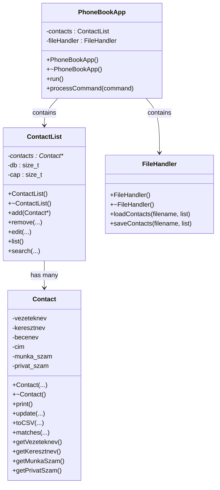

# HOMEWORK ASSIGNMENT

**Fundamentals of Programming 2.**
**NHF4**

Author: Czap László
Neptun code: NS7V2T
Date: May 16, 2025

## Table of Contents

1. [Task](#1-task)
2. [Task specification](#2-task-specification)
3. [Refined task specification](#3-refined-task-specification)
4. [Class design](#4-class-design)
5. [Functions and responsibilities](#5-functions-and-responsibilities)
6. [Algorithms](#6-algorithms)
7. [Testing](#7-testing)
8. [Notes and compliance](#8-notes-and-compliance)
9. [New features compared to the plan](#9-new-features-compared-to-the-plan)
10. [Changes compared to the skeleton](#10-changes-compared-to-the-skeleton)

---

## 1. Task

### Phone book

Design a simplified object model for a phone book application, then implement it! Initially, the phone book should store the following data, but it should later be extendable:

- Name (last name, first name)
- Nickname
- Address
- Work phone number
- Private phone number

The application should, at minimum, support the following operations:

- Adding data
- Deleting data
- Listing

The system may have broader functionality (e.g. editing, searching); it is therefore very important to define the objects and their responsibilities well. Demonstrate the operation with a test program compiled as a separate module! The solution must not use STL containers!

## 2. Task specification

The goal of the program is to create a simple, command-line phone book management application that allows the user to add new entries, delete existing ones, list the data, search and edit entries, and also write the data to a file or read it from a file.

The program is built with an object-oriented approach, using an extensible structure. STL containers may not be used in the solution, so dynamic data structures are managed manually.

The program operates from the command line and can also be tested in batch mode. It reads commands from standard input (stdin), writes output to standard output (stdout), and writes errors to standard error (stderr).

The supported command formats:

- `ADD lastname,firstname,nickname,address,work_number,private_number`
- `DELETE lastname,firstname,phone_number`
- `LIST`
- `SEARCH field_name expression`
- `EDIT lastname,firstname,new_nickname,new_address,new_work_number,new_private_number`
- `LOAD filename`
- `SAVE filename`

The order of the fields is fixed; the `ADD` and `EDIT` commands must always contain exactly six fields, even if some of them are left empty. Optional fields must be left empty (i.e. there is no content between the commas).

The `LIST` command prints every entry, formatted as: `Name: Kiss Pál, Nickname: Pali, Address: 1234 Budapest, Work: +3611234567, Private: +36201234567`

Example of valid input:
```
ADD Kiss,Pál,,,,+36201234567
ADD Tóth,Ágnes,,,+3611112233,
ADD Nagy,László,Laci,1132 Bp,+3619998877,+36209998877
```

Invalid input (no phone number): `ADD Kovács,Kata,,,,` → Error: `At least one phone number must be provided!`

Invalid input (wrong field count): `ADD Kiss,Pál,,,` → Error: `Invalid field count! 6 fields expected.`

Successful `ADD`, `DELETE`, and `EDIT` commands produce no output. Errors are written to stderr.

### Handling phone numbers

The `Contact` class contains two separate fields: work phone number and private phone number. Searching (`SEARCH TEL ...`) checks for a match in either field. The `DELETE` and `EDIT` commands are only executed if the name and the phone number match exactly.

In the CSV file, the phone numbers appear in two separate columns: `work_number` and `private_number`. If either one is unknown, the corresponding field may be left empty.

### File handling

The program supports loading data from a CSV file, as well as saving it in the same format. This ensures compatibility with contact lists.

Format: `lastname,firstname,nickname,address,work_number,private_number`

Example row: `Kiss,Pál,Pali,1234 Budapest,+3611234567,+36201234567`

The `LOAD` command reads the file and treats every line as a contact. The `SAVE` command writes all current contacts to a file in CSV format.

## 3. Refined task specification

- The mandatory fields of the `Contact` class: last name, first name, at least one phone number (work or private)
  - Optional fields: nickname, address
- The `ADD` and `EDIT` commands accept exactly 6 fields; for empty fields the value may be an empty string (`",,"`)
- The `DELETE` and `EDIT` commands operate based on an exact match
- The `LOAD` command checks for an invalid field count and empty lines, skips the header row, and logs invalid lines to stderr
- The `SAVE` command uses a standard, Android-compatible CSV format: `lastname,firstname,nickname,address,work_number,private_number`

## 4. Class design

**Contact**
- Stores the data of a single contact (dynamic fields of type `char*`).
- Constructor, destructor, `toCSV`, `update`, `matches`, `get...` methods.

**ContactList**
- Dynamic array (`Contact**`); handles listing, adding, deleting, searching, and editing entries.
- Expands memory (`expand`) when needed.

**FileHandler**
- Reads data from a file (`loadContacts`).
- Writes data to a file (`saveContacts`).

**PhoneBookApp**
- Runs the application and processes commands.
- Provides `run()` and `processCommand()` methods.

### Class diagram



> Note: the private fields and getters of `Contact` keep their original Hungarian identifiers (`vezeteknev` = last name, `keresztnev` = first name, `becenev` = nickname, `cim` = address, `munka_szam` = work number, `privat_szam` = private number) to match the actual source code.

## 5. Functions and responsibilities

- **Contact**: managing the data of one entry (creation, update, CSV export).
- **ContactList**: adding, deleting, editing, listing, searching.
- **FileHandler**: reading and saving CSV files.
- **PhoneBookApp**: handling user commands.

## 6. Algorithms

- Field-count validation for every input (`ADD`, `EDIT`, `LOAD`).
- Phone number validation (at least one is required).
- Handling invalid lines while reading from a file (invalid lines are logged to stderr).
- Batch mode support: continuous reading of commands from stdin.

## 7. Testing

The `ContactList` functionality is tested with the `gtest_lite` library:

- adding
- deleting
- editing
- search function

Memory usage is verified with `memtrace`.

## 8. Notes and compliance

- Use of STL is prohibited: all array handling is a custom solution.
- Dynamic memory management (`new[]`/`delete[]`).
- Compliant with the JPorta requirements.
- Android-compatible CSV format.
- Robust error handling via stderr.

## 9. New features compared to the plan

- Creation of separate `ContactList`, `FileHandler`, and `PhoneBookApp` classes.
- `main.cpp` only starts the application (`app.run()`).
- Test program for the `ContactList` class (unit tests).
- File handling was moved into its own class.

## 10. Changes compared to the skeleton

The submitted program contains the following additions and changes compared to the provided skeleton:

### Unification of the command format

- Every command works with CSV-like field formatting, i.e. fields are separated by `,`.
- This eliminates errors caused by whitespace and clearly separates the input fields.
- Both last name and first name are given as separate fields, not separated by a space.

### Extension of the `EDIT` command

The new format of the `EDIT` command:

```
EDIT lastname,firstname,phone_number,field_name1:new_value1,field_name2:new_value2,...
```

- Only the specified fields are updated; the rest remain unchanged.
- If no field to modify is specified, the program issues a warning and does not modify anything.

### Duplicate checking

- The `ADD` and `LOAD` commands check whether the given last name + first name + (work or private) number combination already exists.
- If so, the entry is not added, thereby avoiding duplicate records.

### Extension of the `LOAD` command

- The `LOAD` command skips invalid or incomplete lines and issues a warning about them.
- Duplicate checking also applies to newly loaded records.
- The lines of the file are processed safely, with error protection.

### Memory management and STL-freedom

- The implementation does not use STL containers; all dynamic memory management is based on `new[]`/`delete[]`.
- The `Contact::update()` method only overwrites a given field if the new value is not empty.

### Extension of the test code

- The `main_test.cpp` file was modified to test the new `EDIT`, `SEARCH`, `DELETE`, and duplicate-handling logic.
- The tests cover the basic functions of the new behavior and verify the results of `LIST`.
